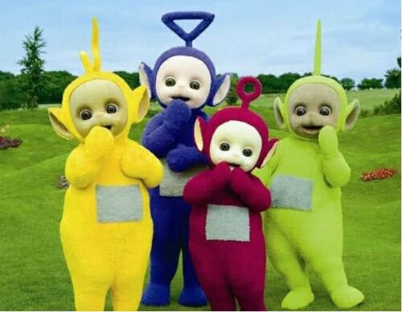

# **stats220** (Assignment purpose!)

## Author: Yanjie Zhou

### Purpose
<!--- numbered list--->
1. The purpose of this website is to show people how to create meme using **R**. 
2. Have a happy life.
3. Sleep well.

### !Notice
* Don't delete any code from this repo
* *No more* 🥦.
* I really love cheese burger


### I gonna show you something!

[This is the link to my repo(plzz stop bring me error!!!!!!!!!!!)](https://jizzx6.github.io/stats220/)

[This is the assignment page. You got to try once this beautiful thing](https://canvas.auckland.ac.nz/courses/75888/assignments/272595)
 A bit spoil of my r work but I guess this is alright. Dang-dang-dang-----
 Wish you all the best with my cuteness teammates!  👻
 
  
And next is [fenced code explaination](https://www.markdownguide.org/extended-syntax/#fenced-code-blocks) (not quite sure why do we use this)
```r
library(magick)
#Import images from web
ideal_team <- image_read("https://static0.cbrimages.com/wordpress/wp-content/uploads/2021/11/Avengers-Age-of-Ultron-Group-Shot.jpg") %>%
  image_scale(500)
#my team pic
your_team <- image_read("http://5b0988e595225.cdn.sohucs.com/images/20190729/4d67b2a19de44fb78f628bc8b157b935.jpeg") %>%
  image_scale(500)

#my team appendent
god_team <- image_blank(width = 500, 
                          height=250, 
                          color = "#000000") %>%
  image_annotate(text = "Team\nYou expected",
                 color = "#FFFFFF",
                 size = 65,
                 font = "Impact",
                 gravity = "center")%?%

# actual team
bad_team <- image_blank(width = 500, 
                         height = 400, 
                         color = "#000000") %>%
  image_annotate(text = "Team\nYou Got",
                 color = "#FFFFFF",
                 size = 65,
                 font = "Impact",
                 gravity = "center")

first_row <- c(ideal_team, god_team) %>%
  image_append()

second_row <- c(your_team, bad_team) %>%
  image_append()
#combine whole works to a meme

(final_one = c(first_row, second_row) %>%
  image_append(stack = TRUE))

#create my pics
(image_write(your_team, "your_team.png"))
(image_write(ideal_team, "ideal_team.png"))
(image_write(c(first_row, second_row) %>%
               image_append(stack = TRUE), "huh.png"))


```
